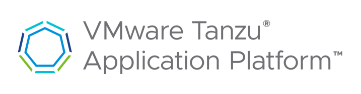

# Getting Started with Tanzu Application Platform (TAP) as a Developer

-   [Tooling](#GettingStartedwithTanzuApplicationPlatf)
-   [Updating an existing (GIT) project for TAP](#GettingStartedwithTanzuApplicationPlatf)

-   [Using an Accelerator for reference](#GettingStartedwithTanzuApplicationPlatf)
-   [Manually](#GettingStartedwithTanzuApplicationPlatf)

-   [Creating a new project](#GettingStartedwithTanzuApplicationPlatf)

-   [Using Application Accelerator](#GettingStartedwithTanzuApplicationPlatf)
-   [From "scratch"](#GettingStartedwithTanzuApplicationPlatf)

-   [References](#GettingStartedwithTanzuApplicationPlatf)

# Tooling

-   Kubectl CLI ([https://kubernetes.io/docs/tasks/tools/#kubectl](https://kubernetes.io/docs/tasks/tools/#kubectl))
-   Tanzu CLI ([https://docs.vmware.com/en/VMware-Tanzu-Application-Platform/1.6/tap/install-tanzu-cli.html#cli-and-plugin](https://docs.vmware.com/en/VMware-Tanzu-Application-Platform/1.6/tap/install-tanzu-cli.html#cli-and-plugin))
-   Tilt v.0.30.12+ ([https://docs.tilt.dev/install.html](https://docs.tilt.dev/install.html))
-   IDE Tooling ([https://network.tanzu.vmware.com/products/tanzu-application-platform/](https://network.tanzu.vmware.com/products/tanzu-application-platform/))

-   IntelliJ Extensions

-   VMware Tanzu Developer Tools for IntelliJ

-   Visual Studio 2022 Extensions

-   VMware Tanzu Developer Tools for Visual Studio

-   VS Code Extensions:

-   VMware Tanzu Developer Tools for Visual Studio Code
-   Debugger for Java
-   Language Support for Java by Red Hat
-   YAML
-   VMware Tanzu App Accelerator (optional)

# Updating an existing (GIT) project for TAP

## Using an Accelerator for reference

[Reference: [Generate an application with Application Accelerator](https://docs.vmware.com/en/VMware-Tanzu-Application-Platform/1.6/tap/getting-started-generate-first-app.html)]

1.  Open the Tanzu Application Platform Accelerators page
2.  Locate the accelerator which most closely matches your application
3.  Fill out the options consistent with your application

1.  Do NOT create a GIT repository

5.  Generate and download the project
6.  Copy the **config** and **catalog** folders from the accelerator to your project

1.  Review and update as needed

8.  Review the other generated components for potential inclusion

## Manually

1. Create a TAP Workload description

	a. TAP configuration folder (e.g. ./config)

	b. Create a Workload yaml (./config/workload.yaml)

	Example:

	```
	apiVersion: carto.run/v1alpha1
	kind: Workload
	metadata:
	  name: helloworld
	  labels:
	    apps.tanzu.vmware.com/workload-type: web
	    app.kubernetes.io/part-of: helloworld
	spec:
	  source:
	    git:
	      url: https://git-enterprise-jc.onefiserv.net/helloworld.git
	      ref:
	        branch: main
	  build:
	    env:
	    - name: BP_JVM_VERSION
	      value: "17"
	  env:
	    - name: NAME
	      value: George
	  params:
	  - name: buildServiceBindings
	    value:
	    - kind: Secret
	      name: settings-xml
	  - name: testing_pipeline_matching_labels
	    value:
	      tap.fiserv.com/build-tool: maven
	```
	References:

	[https://cartographer.sh/docs/v0.0.7/reference/#workload](https://cartographer.sh/docs/v0.0.7/reference/#workload)

2. Configure Tilt

	Example:
	```
	LOCAL_PATH = os.getenv("LOCAL_PATH", default='.')
	CONTEXTS = os.getenv("K8S_DEV_CONTEXTS", default='dev-cluster').split(',')
	NAMESPACE = os.getenv("K8S_DEV_NAMESPACE", default='helloworld')
	FEAD = os.getenv("FEAD", default='unknown')
	WORKLOAD_NAME = 'network-policy-provisioning-api-' + FEAD
	k8s_custom_deploy(
	    WORKLOAD_NAME,
	    apply_cmd="tanzu apps workload apply -f ./tap/config/workload-" + FEAD + ".yaml --update-strategy replace --debug --live-update" +
	        " --local-path " + LOCAL_PATH +
	        " --namespace " + NAMESPACE +
	        " --yes --output yaml", 
	    delete_cmd="tanzu apps workload delete -f ./tap/config/workload-" + FEAD + ".yaml --namespace " + NAMESPACE + " --yes", 
	    deps=['pom.xml', './target/classes'],
	    container_selector='workload',
	    live_update=[
	        sync('./target/classes', '/workspace/BOOT-INF/classes')
	    ]
	)

	k8s_resource(WORKLOAD_NAME, port_forwards=["8080:8080"],
	    extra_pod_selectors=[{'carto.run/workload-name': WORKLOAD_NAME, 'app.kubernetes.io/component':'run'}])

	allow_k8s_contexts(CONTEXTS)
	update_settings ( k8s_upsert_timeout_secs = 120 )

	References:

	[https://docs.tilt.dev/tiltfile_authoring](https://docs.tilt.dev/tiltfile_authoring)
	```

3. Configure your IDE

	a. IntelliJ: [https://docs.vmware.com/en/VMware-Tanzu-Application-Platform/1.6/tap/intellij-extension-about.html](https://docs.vmware.com/en/VMware-Tanzu-Application-Platform/1.6/tap/intellij-extension-about.html)

	b, Visual Studio 2022: [https://docs.vmware.com/en/VMware-Tanzu-Application-Platform/1.6/tap/vs-extension-about.html](https://docs.vmware.com/en/VMware-Tanzu-Application-Platform/1.6/tap/vs-extension-about.html)

	c. Visual Studio Code: [https://docs.vmware.com/en/VMware-Tanzu-Application-Platform/1.6/tap/vscode-extension-about.html](https://docs.vmware.com/en/VMware-Tanzu-Application-Platform/1.6/tap/vscode-extension-about.html)

4. Create a Catalog description

Example:
```
apiVersion: backstage.io/v1alpha1
kind: Component
metadata:
  name: helloworld
  description: Sample Java Application
  tags:
    - tanzu
  annotations:
    'backstage.io/kubernetes-label-selector': 'app.kubernetes.io/part-of=helloworld'
spec:
  type: service
  lifecycle: experimental
  owner: my-team
```

References:

[https://docs.vmware.com/en/VMware-Tanzu-Application-Platform/1.6/tap/tap-gui-catalog-catalog-operations.html](https://docs.vmware.com/en/VMware-Tanzu-Application-Platform/1.6/tap/tap-gui-catalog-catalog-operations.html)

[https://backstage.io/docs/features/software-catalog/descriptor-format/](https://backstage.io/docs/features/software-catalog/descriptor-format/)

# Creating a new project

## Using Application Accelerator

[Reference: [Generate an application with Application Accelerator](https://docs.vmware.com/en/VMware-Tanzu-Application-Platform/1.6/tap/getting-started-generate-first-app.html)]

## From "scratch"

# References

[Tanzu Application Platform Documentation](https://docs.vmware.com/en/VMware-Tanzu-Application-Platform/index.html)

[Generate an application with Application Accelerator](https://docs.vmware.com/en/VMware-Tanzu-Application-Platform/1.6/tap/getting-started-generate-first-app.html)
